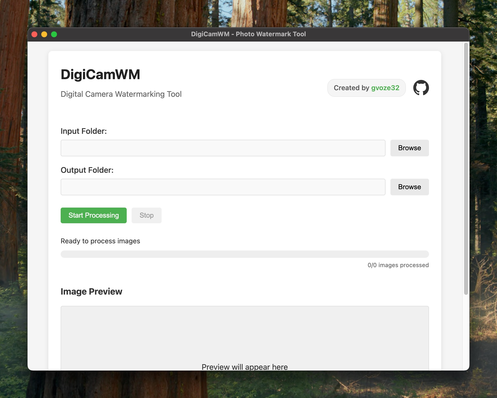

# DigiCamWM

[🇬🇧 English](README.md) | 🇮🇩 Bahasa Indonesia


Alat watermark kamera digital yang kuat untuk menambahkan bingkai profesional dengan informasi kamera pada foto Anda. Dibangun dengan [Tauri v2](https://tauri.app/) dan Rust untuk performa native di desktop dan mobile.



## Fitur

- 📷 Mengekstrak data EXIF dari foto (model kamera, pengaturan, tanggal/waktu)
- 🖼️ Menambahkan bingkai watermark profesional dengan info kamera
- 🏞️ Mendukung orientasi potret dan landscape
- 🚀 Kemampuan pemrosesan batch
- 🎨 UI yang bersih dan minimal yang mudah digunakan
- 💻 Lintas platform (Windows, macOS, Linux, Android, iOS)
- ⚡ Backend Rust native untuk pemrosesan gambar cepat

## Instalasi

### Unduh

Unduh versi terbaru dari [halaman Releases](https://github.com/gvoze32/digicamwm/releases).

### Platform yang Didukung

- **Windows**: Unduh installer `.exe` (NSIS) atau `.msi`
- **macOS**: Unduh file `.dmg` (Apple Silicon & Intel)
- **Linux**: Unduh file `.AppImage`, `.deb`, atau `.rpm`
- **Android**: Unduh file `.apk`
- **iOS**: Build dari source dengan Xcode

### Mengatasi Masalah Instalasi

#### Masalah Keamanan macOS

Jika Anda mengalami peringatan keamanan di macOS saat mencoba membuka aplikasi ("DigiCamWM rusak dan tidak dapat dibuka. Anda harus memindahkannya ke Trash."), Anda dapat menggunakan perintah Terminal berikut untuk menghapus atribut karantina:

```bash
xattr -c /Applications/DigiCamWM.app
```

Ini menghapus tanda karantina yang diterapkan macOS pada aplikasi yang diunduh dari internet.

## Penggunaan

### Aplikasi GUI

1. Buka aplikasi DigiCamWM
2. Pilih folder input yang berisi foto
3. Pilih folder output untuk gambar yang diproses
4. Klik "Start Processing"
5. Lihat hasilnya di folder output

## Pengembangan

### Prasyarat

- [Node.js](https://nodejs.org/) (v18 atau lebih baru)
- [npm](https://www.npmjs.com/) (v9 atau lebih baru)
- [Rust](https://www.rust-lang.org/tools/install) (via rustup)
- Dependensi spesifik platform (lihat [prasyarat Tauri](https://tauri.app/start/prerequisites/))

### Setup

```bash
# Klon repositori
git clone https://github.com/gvoze32/digicamwm.git
cd digicamwm

# Install dependensi
npm install
```

### Menjalankan dalam Mode Pengembangan

```bash
# Desktop
npm run dev

# Android
npx tauri android dev

# iOS
npx tauri ios dev
```

### Build dari Source

```bash
# Build untuk platform Anda saat ini
npm run build

# Build untuk Android
npx tauri android build

# Build untuk iOS
npx tauri ios build
```

## Dukungan Logo Brand Kamera

DigiCamWM akan secara otomatis mencari logo brand kamera di folder `assets/models`. File harus diberi nama sesuai dengan produsen kamera (huruf kecil) dengan ekstensi `.png`.

Contoh:

- `assets/models/sony.png`
- `assets/models/canon.png`
- `assets/models/nikon.png`

## Teknologi

- [Tauri v2](https://tauri.app/) - Framework aplikasi lintas platform (desktop & mobile)
- [Rust](https://www.rust-lang.org/) - Backend untuk pemrosesan gambar
- [Vite](https://vitejs.dev/) - Build tool frontend
- [image](https://crates.io/crates/image) - Pemrosesan gambar Rust
- [kamadak-exif](https://crates.io/crates/kamadak-exif) - Ekstraksi metadata EXIF
- [resvg](https://crates.io/crates/resvg) - Rendering SVG

## Kontribusi

Kontribusi sangat disambut! Silakan merasa bebas untuk mengajukan Pull Request.

## Lisensi

Proyek ini dilisensikan di bawah Lisensi ISC - lihat file [LICENSE](https://github.com/gvoze32/digicamwm/blob/main/LICENSE) untuk detailnya.
