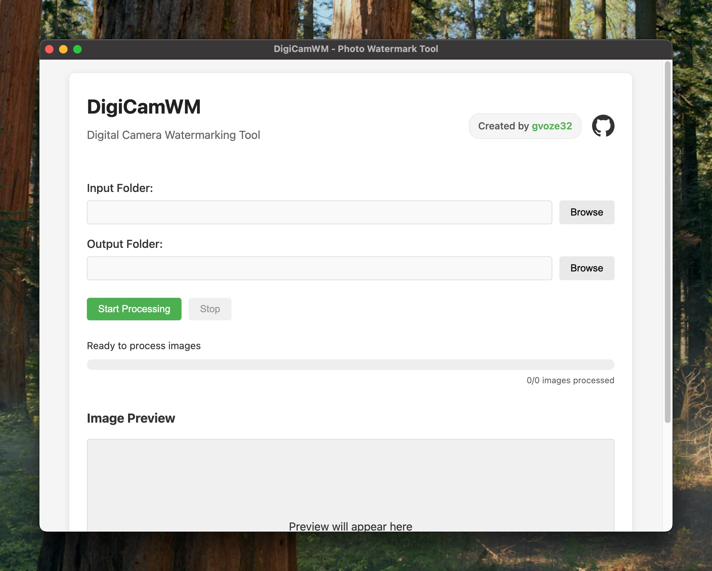

# DigiCamWM

🇬🇧 English | [🇮🇩 Bahasa Indonesia](README.ID.md)


A powerful digital camera watermarking tool that adds professional-looking frames with camera information to your photos.



## Features

- 📷 Extracts EXIF data from photos (camera model, settings, date/time)
- 🖼️ Adds professional watermark frames with camera info
- 🏞️ Supports both portrait and landscape orientations
- 🚀 Batch processing capabilities
- 🎨 Clean, minimal UI that's easy to use
- 💻 Cross-platform (Windows, macOS, Linux)

## Installation

### Download

Download the latest version from the [Releases page](https://github.com/gvoze32/digicamwm/releases).

### Supported Platforms

- **Windows**: Download the `.exe` installer
- **macOS**: Download the `.dmg` file
- **Linux**: Download the `.AppImage` file

### Troubleshooting Installation

#### macOS Security Issues

If you encounter security warnings on macOS when trying to open the application ("DigiCamWM is damaged and can’t be opened. You should move it to the Trash."), you can use the following Terminal command to remove the quarantine attribute:

```bash
xattr -c /Applications/DigiCamWM.app
```

This removes the quarantine flag that macOS applies to applications downloaded from the internet.

## Usage

### GUI Application

1. Launch the DigiCamWM application
2. Select your input folder containing photos
3. Choose an output folder for processed images
4. Click "Start Processing"
5. View the results in your output folder

### Command Line Interface

DigiCamWM also offers a command line interface:

```bash
# Basic usage
node index.js --raw /path/to/input --processed /path/to/output
```

## Development

### Prerequisites

- [Node.js](https://nodejs.org/) (v14 or newer)
- [npm](https://www.npmjs.com/) (v6 or newer)

### Setup

```bash
# Clone the repository
git clone https://github.com/gvoze32/digicamwm.git
cd digicamwm

# Install dependencies
npm install
```

### Running in Development Mode

```bash
npm run dev
```

### Building from Source

```bash
# Build for your current platform
npm run build

# The packaged application will be in the 'dist' folder
```

## Camera Brand Logo Support

DigiCamWM will automatically look for camera brand logos in the `assets/models` folder. The file should be named according to the camera manufacturer (lowercase) with a `.png` extension.

For example:

- `assets/models/sony.png`
- `assets/models/canon.png`
- `assets/models/nikon.png`

## Technologies

- [Electron](https://www.electronjs.org/) - Cross-platform desktop app framework
- [Sharp](https://sharp.pixelplumbing.com/) - High-performance image processing
- [exif-parser](https://www.npmjs.com/package/exif-parser) - EXIF metadata extraction

## Contributing

Contributions are welcome! Please feel free to submit a Pull Request.

## License

This project is licensed under the ISC License - see the [LICENSE](https://github.com/gvoze32/digicamwm/blob/main/LICENSE) file for details.
